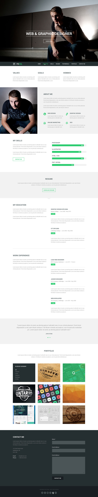

# Convert Design Into Responsive Coding
A responsive front-end implementation of a free PSD/template design inspired by classic HTML & CSS workflows.

Originally recreated as part of a learning experience, then extended with additional responsive enhancements and personalized UI refinements to improve usability and layout behavior.

## 🚀 Live Preview

| Template | Technologies | Demo |
| :--- | :---: | :---: |
| **Focal** | HTML, CSS | [Live Preview](https://Alexander-Sands.github.io/focal/) |

---

## ✨ Features

- Responsive Design
- Classic Layout Structure
- Clean HTML & CSS Organization
- UI Improvements & Tweaks
- Cross-Browser Friendly
- Flexbox/Grid used where necessary

---

## 🛠 External Resources

| Resource | Website (click to visit) |
| :--- | :--- |
| Normalize.css | [`normalize.css`](https://necolas.github.io/normalize.css/) |
| Font Awesome | [`all.min.css`](https://fontawesome.com/) |
| Google Fonts | [`Open Sans`](https://fonts.google.com/) |

---

## 👨‍💻 Credits

| Role | Name |
| :--- | :--- |
| Design Reference | Focal PSD Template |
| Tutorial / Learning Source | Elzero Web School |
| Front-End Development | AbdelRahman Khalaf |

---

## 🖼 Design Preview
<!--  -->

## 📄 Notes

This project is intended for educational and portfolio purposes only.
Original design credits belong to their respective owner(s).

